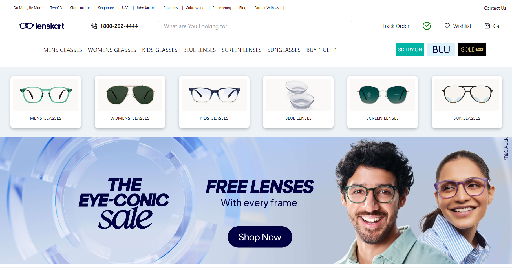

# Lenskart Clone

Welcome to the Lenskart Clone project! This repository contains a fully functional web application replicating the core features and user experience of the popular eyewear retail platform, Lenskart. This project demonstrates advanced web development skills using modern technologies and best practices.

## Table of Contents

- [Features](#features)
- [Technologies Used](#technologies-used)
- [Installation](#installation)
- [Usage](#usage)
- [Screenshots](#screenshots)
- [Contributing](#contributing)
- [License](#license)

## Features

- **User Authentication**: Secure user login and registration using JWT.
- **Product Catalog**: Dynamic display of eyewear products with search and filter options.
- **Product Details**: Detailed view of each product with images, descriptions, and pricing.
- **Shopping Cart**: Add, update, and remove products from the cart.
- **Checkout Process**: Seamless checkout process with order summary and payment integration.
- **Responsive Design**: Optimized for both desktop and mobile devices.
- **Admin Panel**: Manage products, orders, and users with ease.
- **Wishlist**: Users can save products to their wishlist for future reference.
- **Reviews and Ratings**: Customers can leave reviews and ratings for products.
- **Virtual Try-On**: Try-on feature using the device camera for a real-time experience.

## Technologies Used

- **Frontend**:
  - HTML5, CSS3, JavaScript
  - React.js for building a responsive and dynamic user interface
  - Redux for state management
  - Axios for API calls

- **Backend**:
  - Node.js and Express.js for server-side logic
  - MongoDB with Mongoose for database management
  - JSON Web Tokens (JWT) for authentication
  - Stripe API for payment processing

- **Development Tools**:
  - Visual Studio Code for code editing
  - Git and GitHub for version control
  - Postman for API testing
  - ESLint and Prettier for code formatting and linting

## Installation

1. **Clone the repository**:
   ```bash
   git clone https://github.com/yourusername/lenskart-clone.git
   cd lenskart-clone

## Set up environment variables:
1.  Create a .env file in the backend directory and add your configuration details:
```
PORT=5000
MONGODB_URI=your_mongodb_uri
JWT_SECRET=your_jwt_secret
STRIPE_SECRET_KEY=your_stripe_secret_key
```

## Run the application:

```
# Start the backend server
cd backend
npm start

# Start the frontend server
cd ../frontend
npm start

```

## Access the application:
    - Open your browser and navigate to http://localhost:3000

## Usage

1. **Register** or **Log in** to your account.
2. Browse the **Product Catalog** and use the search or filter options to find specific items.
3. View **Product Details** for more information and to use the **Virtual Try-On** feature.
4. Add products to your **Shopping Cart** and proceed to **Checkout**.
5. Manage your account, view **Wishlist**, and read or write **Reviews**.


## Contributing

Contributions are welcome! Please fork this repository and submit a pull request for any enhancements, bug fixes, or new features.

1. **Fork the repository**:
   Click the "Fork" button at the top right corner of this repository page.

2. **Clone your forked repository**:
   ```bash
   git clone https://github.com/yourusername/lenskart-clone.git
   cd lenskart-clone
   git checkout -b feature/your-feature-name
   git add .
   git commit -m 'Add some feature'
   git push origin feature/your-feature-name


### Feel free to adjust any instructions to match your workflow or project needs!


